```{r setup, include=FALSE}
knitr::opts_chunk$set(warning = FALSE, message = FALSE, 
                      fig.retina = 3, fig.align = "center")
```

```{r packages-data, include=FALSE}
pacman::p_load(tidyverse, sjPlot, ggsci, wordcloud2)
theme_set(theme_sjplot2())
uah <- readRDS(url("https://github.com/learn-R/formR/raw/main/output/data-surveys.rds")) %>%   filter(university == "UAH" & rut !="")
datos <- dplyr::select(uah, id, rut, day, use_r, reason)
```

```{r xaringanExtra, echo=FALSE}
xaringanExtra::use_xaringan_extra(c("tile_view", "animate_css", "share_again", "scribble", "frezeeframe"))
```

class: center middle main-title section-title-1 top-logo

.small[
# Herramientas para el uso de R
]

.class-info[
<br>
**Sesión N° 1**<br>
**Análisis de datos estadísticos en R**
<br>

.pull-right.small[
**Profesora** Valentina Andrade de la Horra <br>
**Ayudantes** Dafne Jaime y Nicolás Godoy
.tiny[Universidad Alberto Hurtado<br>
]
]

]

---

name: outline
class: title title-inv-1

# Contenidos

--

.box-1.medium.sp-after-half[R **enviroment**]

--

.box-3.medium.sp-after-half[R **consulta**]

--

.box-7.medium.sp-after-half[R **comunicación**]

--

.box-6.medium.sp-after-half[Detalles del curso]

---
name: outline
class: title title-inv-8

# Introducción

.box-8.medium.sp-after-half[¿Y no bastaba aprender SPSS?]

--
.center[

]

---
name: outline
class: title title-inv-8

# Introducción

.box-8.medium.sp-after-half[El contexto del curso]

--

.pull-left.box-1.center[Mayor uso de R en las ciencias <br>

También en las **ciencias sociales**]

--

.pull-right.box-7.center[Las universidades incluyen cada vez más este software y otros en sus planes de estudio]

---
name: outline
class: title title-inv-8

.center[
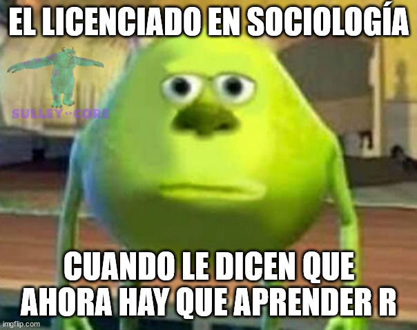
]

---
name: outline
class: title title-inv-8

# Razones: empleabilidad

.pull-left.code[

.box-8[Ustedes en datos]

.small[
```{r razones, echo = F, fig.width=20, fig.height=15}
uah %>% select(1:number_reporte) %>% 
  group_by(reason) %>% 
  summarise(n = n()) %>% 
  mutate(prop = n/sum(n)*100) %>% 
  ggplot(aes(x = reorder(reason, -prop), y = prop, fill = reason)) +
  geom_bar(stat = "identity", color = "black") +
  geom_text(aes(label = paste0(round(prop,1), "%")), vjust=-0.25, size = 16) +
  labs(x = "", y = "%", title = "Razón principal para tomar el curso") + 
  guides(fill = F) + theme(text = element_text(size = 50)) +
  scale_fill_futurama()
```
]]
--

.pull-right.code[

.box-2[Ustedes en la vida real]
.center[
<figure>
  
</figure>]
]
---
name: outline
class: title title-inv-8

.small[
# El tema de fondo: crisis de la reproducibilidad
]

.pull-left.code[
<figure>
  
</figure>
]

--

.pull-right.code[
<figure>
  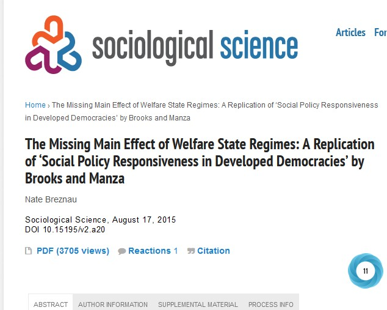
</figure>
]

--

.pull-middle-8[
&nbsp;

.box-inv-1[El conocimiento como un [**bien común**](https://www.youtube.com/watch?v=ukdnX2clG9M)]
]

---
name: outline
class: center middle section-title section-title-8 animated fadeIn


# ¿Qué tiene que ver todo esto con R? 🤔

---
name: outline
class: title title-inv-8

.small[
# R: una herramienta para la ciencia abierta
]

.pull-right[.box-2[**libre**] .box-3[**gratis**]]

- Una herramienta de "ambiente" (*R enviroment*): 

--

- Cada vez más uso en Chile 🇨🇱

--

- Pero no necesariamente con un propósito de "ciencia abierta" 👎

---
name: outline
class: title title-inv-8

.small[
# Experiencia tradicional sobre R
]
.center[
```{r wordcloud, echo = F}
set.seed(191247329)

before <- uah %>% select(1:number_reporte) %>% 
  pivot_longer(cols =c(beforer_1:beforer_7), names_to = "number_mention", values_to = "beforer") %>%
  filter(!is.na(beforer)) %>% 
  group_by(beforer) %>% 
  summarise(n = n()) %>%
  arrange(-n) %>% 
  ungroup() %>%
  mutate(beforer1 = beforer) %>% 
  column_to_rownames(var = "beforer1")

wordcloud2::wordcloud2(before)
```
*Tal como ustedes mismos la cuentan*]
---
name: outline
class: title title-inv-8

.small[
# R: una herramienta para la ciencia abierta
]
.box-7-inv[La colaboración y trabajo en equipo **facilita el aprendizaje**]

.small.center[
<figure>
  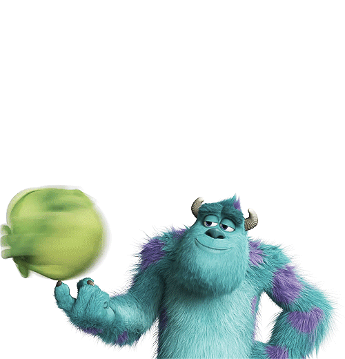
</figure>
]
---
name: outline
class: title title-inv-8
.small[
# Componente humano: el equipo del curso

.center[
<figure>
  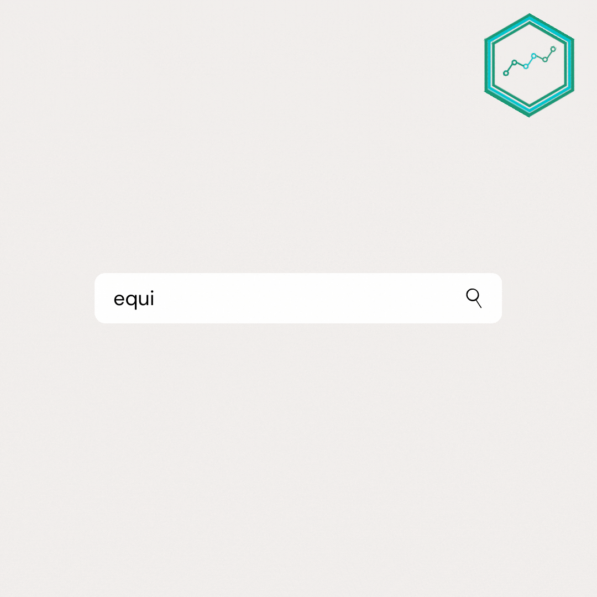
</figure>
]

]
---
name: outline
class: title title-inv-8

.small[
# Componente técnico: [*rOpensci*](https://ropensci.org/)

.center[
<figure>
  
</figure>
]

]

---
layout: false
name: ds-ps
class: center middle section-title section-title-1 animated fadeIn

.center[
<figure>
  
</figure>
]

# ¡ Vamos a conocerlas!
---
layout: false
name: ds-ps
class: center middle section-title section-title-1 animated fadeIn

# 1. R<br>enviroment

---
name: ds-ps
class: title title-1

# 1.1 ¿Qué es R?

.center[Muchas/os piensan que es un programa estadístico]

--

.box-inv-1[R es un **lenguaje** y un **ambiente** dentro del cual técnicas **estadísticas pueden ser implementadas**]

--

.box-inv-7[El concepto *enviroment* intenta darnos la idea de un sistema coherente y planificado]

---
class: title title-1

# 1.1 ¿Qué es R?

.box-1[R enviroment características:]

--

.box-3[ (1) Facilta manipulación y almacenaje de datos]

--
.box-4[ (2) Permite cálculos y visualización de datos]

--
.box-5[ (3) Es coherente y capaz de integrarse con otras herramientas]

--

.box-6[ (4) Simple, pero capaz de realizar procedimientos complejos]

--

.box-7[ (5) Gracias a la colaboración, sus potenciales pueden ser extendidos a partir de **paquetes**]

---

class: bg-full
background-image: url("img/01/terminal-r.jpg")

???

---

.center[

]
---
name: ds-ps
class: center middle section-title section-title-1 animated fadeIn

.box-1-inv.large[# Tranquilidad, espera un segundo . . . 🥁]

---
name: ds-ps
class: center middle section-title section-title-1 animated fadeIn

.small[
.box-1-inv.large[# ¡RStudio!]


.box-inv-3[el IDE (*integrated development enviroment*) para R]
]
---
class: title title-1

# 1.1 RStudio

-  Integra lenguaje R con diferentes herramientas para facilitar su uso:

.pull-left.center[
.box-inv-2[(1) Consola]
<figure>
  
</figure>
]

.pull-left.center[
.box-inv-2[(2) Editor de sintaxis (código)]
<figure>
  
</figure>
]


---
class: title title-1

# 1.1 RStudio

.pull-left.small[
.box-inv-2[(3) Enviroment ]
<figure>
  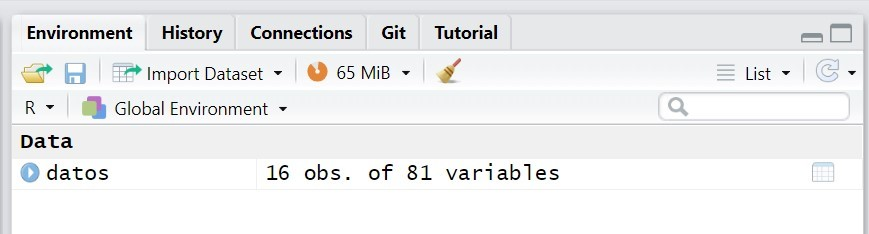
</figure>
]

.pull-right.small[
.box-inv-2[(4) Workspace]
<figure>
  
</figure>
]

---
class: title title-1

# 1.1 RStudio

.pull-middle.small[
.box-inv-2[(5) Plot, debugging (bugs o errores), historia]
<figure>
  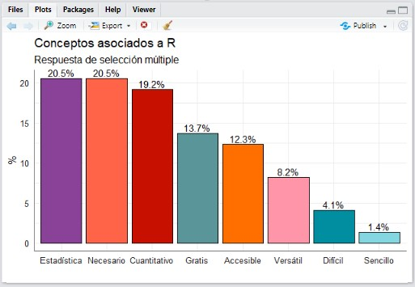
</figure>
]

---
name: ds-ps
class: center middle section-title section-title-1 animated fadeIn

.small[
.box-1-inv.large[# ¡Vamos a conocerlo!]

.box-inv-1[ Opción (1) con RStudio: [descargar el zip en el sitio del curso]((https://learn-r-uah.netlify.app/content/01-content/)]
]

.box-inv-1[ Opción (2) con RStudio Cloud: [ir al RStudio del curso]((https://rstudio.cloud/spaces/60366/join?access_code=iSzSuF94ZXVUL53mJEyhOvtKVAActaw0nQ8S%2FxAB)]


---
layout: false
name: evidence-evaluation-causation
class: center middle section-title section-title-3 animated fadeIn

# ¡Para tantas preguntas, *casi* **siempre** hay respuestas!

---
layout: false
name: evidence-evaluation-causation
class: center middle section-title section-title-3 animated fadeIn

# 2. R consulta

---
layout: true
class: title title-3

---

# Una de las claves para aprender R

.center[
<figure>
  
</figure>
]

---

# R consultas

.box-inv-3.medium[Gracias a su carácter abierto y colaborativo]

--

.box-inv-3.medium.sp-after[Existe una **gran** comunidad de usuarios que contestan dudas ]

--

.box-3.medium[O incluso que hacen talleres masivos]

???

Rladies, userR

---
# 2.1 ¿Dónde consultar en R? 
.box-inv-3[(o mejor dicho **buscar respuestas**)]

--

.pull-left-code[<figure>
  
</figure>
.box-inv-3.small[Stackoverflow ➡ sobre códigos en general]]

--

.pull-left-code[<figure>
  
</figure>
.box-inv-3.small[RStudio Community ➡ más específica]]

--

.pull-right-code[
.box-inv-3.small[CRAN ➡ Archivo de R, consulta sobre paquetes y documentación]
]

--

???

- https://stackoverflow.com/

-- https://stackoverflow.com/questions/33026167/reading-sav-file-into-r

- https://community.rstudio.com/t/help-with-filter-and-select-function/15843

- https://cran.r-project.org/: abordaremos este más la próxima sesión/ y rdocumentation

---

# Ventajas

--

.box-inv-3.medium[(1) Las preguntas y respuestas están evaluadas]

--

.box-inv-3.medium[(2) Las preguntas y respuestas son reproducibles]

--

.box-inv-3.medium[(3) Las preguntas y respuestas tienen fecha]

--

.box-inv-6.medium[Desventaja : están en inglés]


???


---

layout: false

&nbsp;

.box-3.large[¿Dónde **evitar** preguntar y buscar respuestas?]

--

.box-inv-3.medium[Esto se llama *"usted no lo haga"*]

---
layout: true
class: title title-3

---
# Ustedes no lo hagan 😥

.pull-left.center[
<figure>
  
</figure>
]

--

.pull-right.center[
<figure>
  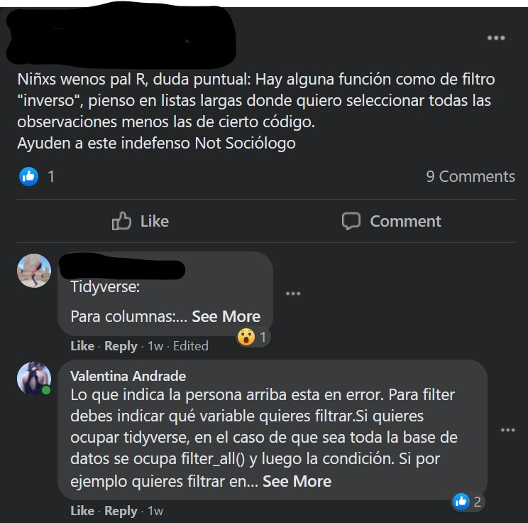
</figure>
]


---

# Acompáñenme a ver esta triste historia 😥

.center[
<figure>
  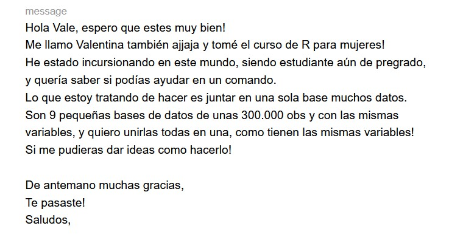
</figure>
]


???

https://mail.google.com/mail/u/0/#search/formspree/FMfcgzGkXdCRnlcDCRmwQXXpbHzhtzdJ

---
# En síntesis

✅ Parta por buscar su error y consulta

✅ Prefiera stackoverflow y RStudio Community

✅ Si aún tienes dudas pregúntale a alguien especializado. 

✅ Se lo más específico posible, 🙏 envíes pantallazos🙏


---
layout: false
name: evidence-evaluation-causation1
class: center middle section-title section-title-6 animated fadeIn

# Y tranquila/o, no estarás sola/o en este proceso

---
name: evidence-evaluation-causation
class: center middle section-title section-title-6 animated fadeIn

# R colaboración y comunicación

---
name: evidence-evaluation-causation
class: center section-title section-title-6 animated fadeIn

# R comunicación 

--
.tiny[
.pull-left[<figure>
  
</figure>
.box-inv-3.medium[Slack ➡ canal de comunicación del curso]]

--

.pull-right[<figure>
  
</figure>
.box-inv-3.medium[GitHub ➡ control de cambios de códigos]]

--

.pull-medium[<figure>
  
</figure>
.box-inv-3.medium[Rprojects ➡  projecto con su propio ambiente]
]
]

---
layout: true
class: title title-6

---
# 11. Rprojects

- Permite crear un **directorio propio** 🌱 para un proyecto

- Este directorio propio podrá contener **todos** los recursos que utilizas para tu proyecto (sintaxis, datos, figuras)

.scale[
]

---
# 1. Rprojects

- Sirve para esclarecer los flujos de trabajos

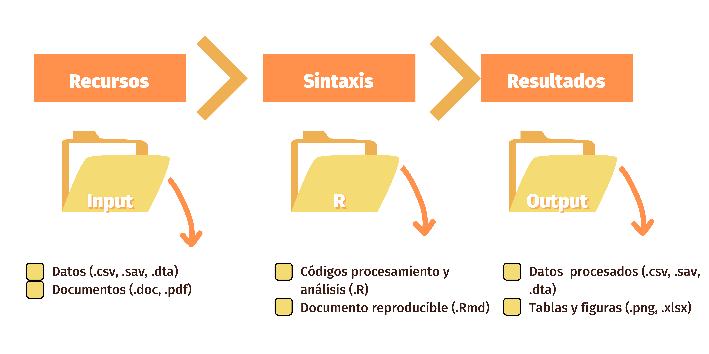
---
# 1. RProjects

- Evita errores de definición de espacio de trabajo (*Working directory*)

```{r error1, message = TRUE, error=TRUE}

datos <- read.csv("datos.csv") #<<

```

--

- Un error muy **clásico** 😖

---
# 1. RProjects

- En caso contrario hay que ser unos detectives de rutas de los archivos🕵️‍♀️😂

```{r error, eval = F, echo = T}

datos <- read.csv("ruta_hacia_los_datos/datos.csv") #<<

datos <- read.csv("c: mi computador/carpeta datos/mi proyecto del curso/datos.csv")

```

---
# 1. Rprojects

- Sirve para esclarecer los flujos de trabajos


---
class: center middle section-title section-title-6 animated fadeIn

# ¡Vamos a ver cómo se hacen los .Rproject! 🧐

---
class: center middle section-title-inv-6 section-title-inv-6 animated fadeIn

# ¿ Y qué pasa si trabajo con más personas a la vez? 🤔

---

.box-6[Evidentemente compartir todos los archivos y "simular" un mismo ambiente de trabajo ayuda mucho a trabajar en equipo]

--

.box-7[¿Existe forma de ir haciendo controles de versiones? (*así como en Word*)]


--

.box-inv-6.large[**¡Sí**!]

---
class: title title-6

# 2. GitHub
.center[
]
---
class: title title-inv-6

# 2. GitHub

- Es un **Sistema de control de versiones** (*VCS*)

**Permite**

☑ Almacenaje de código

☑ Historial de cambios

☑ Trabajo en equipo

---
class: title title-6

# 2. El flujo de GitHub

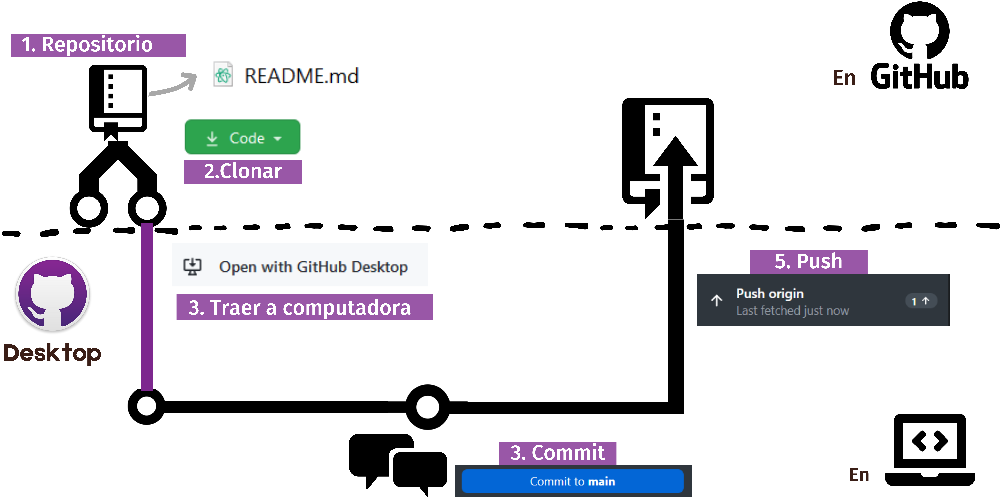

---
class: center section-title section-title-6 animated fadeIn

# ¡Vamos cómo es GitHub!


???

https://guides.github.com/introduction/flow/

---
class: center section-title section-title-6 animated fadeIn


# Paso a paso iremos asimilando estos programas

--

## ¡De hecho el [práctico N°1](https://learn-r-uah.netlify.app/example/01-practico/) está orientado principalmente a estas herramientas!

---
class: center section-title section-title-1 animated fadeIn

# En síntesis


.box-1.medium.sp-after-half[R **enviroment**]

--

.box-3.medium.sp-after-half[R **consulta**]

--

.box-7.medium.sp-after-half[R **comunicación**]


---
class: title title-1

# En síntesis
.center[
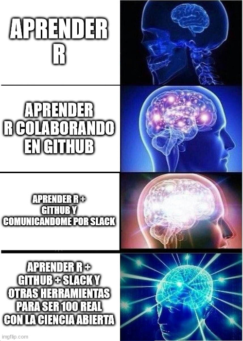]
---

layout: false
name: class-details
class: center middle section-title section-title-7 animated fadeIn

# Detalles del curso

---

layout: true
class: title title-7

---

# Plan del curso

.center[
<figure>
  
</figure>
]

---

# Organización

.pull-left-7.center[
<figure>
  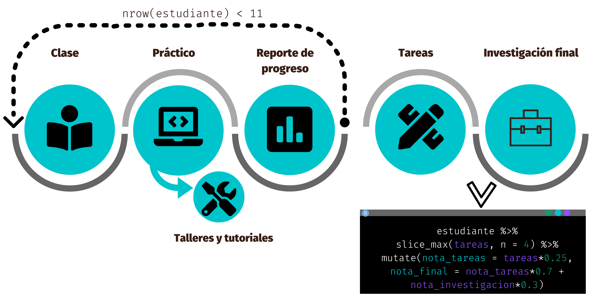
</figure>
]

---

# Evaluaciones

| Evaluación    | Formato       | Fecha |  Ponderación Nota Final   |
| ------------- |:-------------:| -----:| -------------------:|
| Tarea         | 4 tareas   | *Hasta Viernes de la semana informada* | 70% (25% c/u)|
| Investigación | Única entrega | 22 de noviembre  | 30% |


-  A lo largo del semestre deberá entregar 6 tareas: 5 calificadas (Tarea 1 a Tarea 5) y 1 no (Tarea 0). De las 5 tareas restantes, solo las 4 mejores serán consideradas en su promedio de las tareas.]

---

# Convivencia virtual


---

# Recursos del curso

.center[
<figure>
  
</figure>

<figure>
  
</figure>
]

---

# Recursos del curso

.center[
<figure>
  
</figure>
] 

---

# Recursos del curso
.center[
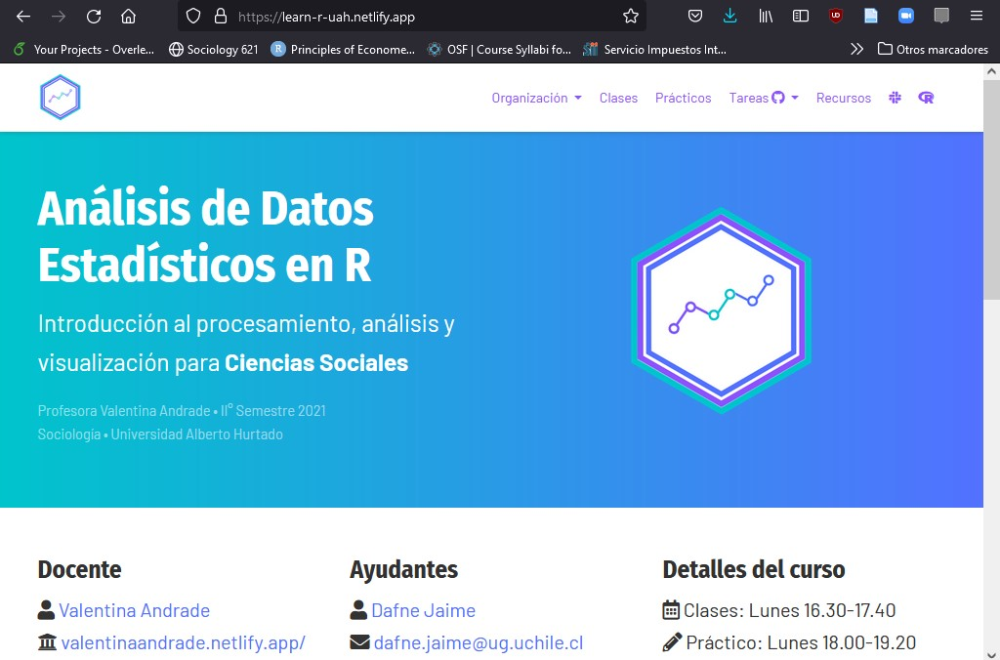
]

---

# ¿Los haré científicos de datos?

--

.box-inv-7.huge[**No!**]

--

.box-7[No tienes que ser un "mecánico" para manejar correctamente]

--

.box-7[No tienes que ser un *computín* para usar R correctamente]

???

https://twitter.com/ameliaritger/status/1214682596182904832?s=12

Drivers, mecanicos, ingenieros. 
No necesitas ser mecanico para tener licencias... pero si lo necesitaras si quieres cambiar cosas en tu auto. Tampoco necesitas ser ingeniero/a, solo si quieres crear algo nuevo (al menos en ciencias sociales)

https://twitter.com/Sumidu/status/1214695065387438083

---

layout: false
class: center middle

.box-7.huge[¡Tú puedes! (podremos juntas/os)]

---

layout: true
class: title title-7

---

# Y con esto lograrás

.center[
<figure>
  
</figure>
]

---

# Pre-requisitos

--

.box-7.small[**Herramientas tecnológicas**]

.box-inv-7.small.sp-after[Un computador e internet]

--

.box-7.small[**Habilidades de la ciencia computacional**]

.box-inv-7.small.sp-after[No]

--

.box-7.small[**Habilidades estadísticas**]

.box-inv-7.small[Estadística descriptiva, inferencial y regresiones]

---
layout: false
class: bg-full animated fadeIn title-1
background-image: url("img/01/r.gif")


# ¡Y muchas ganas de aprender!

---
layout: false

.box-1[¿Y eso era?]

--

.box-inv-1[¡Solo por la sesión de hoy!]

.center[
]
---
layout: false
class: center middle main-title section-title-1 top-logo

.small[
# Herramientas para el uso de R
]

.class-info[
<br>
**Sesión N° 1**<br>
**Análisis de datos estadísticos en R**
<br>

.pull-right.small[
**Profesora** Valentina Andrade de la Horra <br>
**Ayudantes** Dafne Jaime y Nicolás Godoy
.tiny[Universidad Alberto Hurtado<br>
]
]

]
