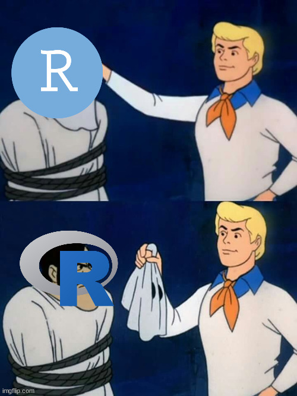
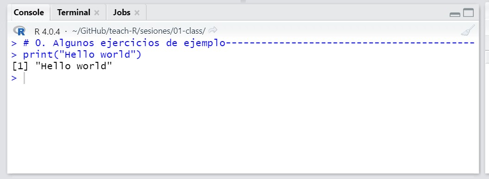
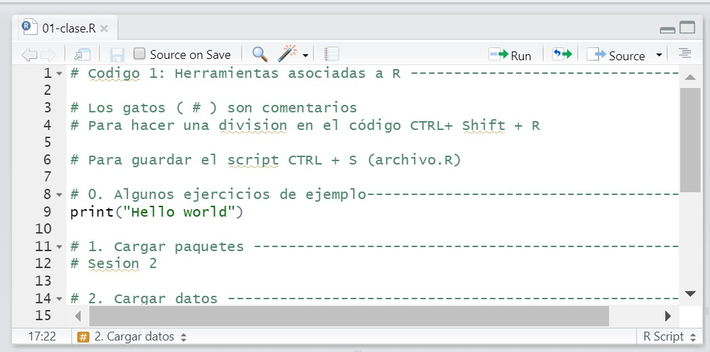
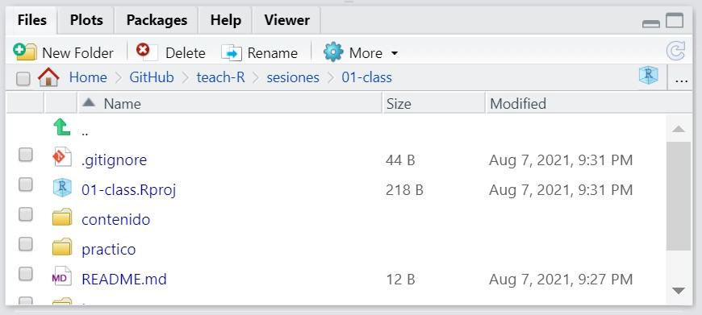
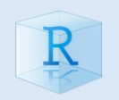
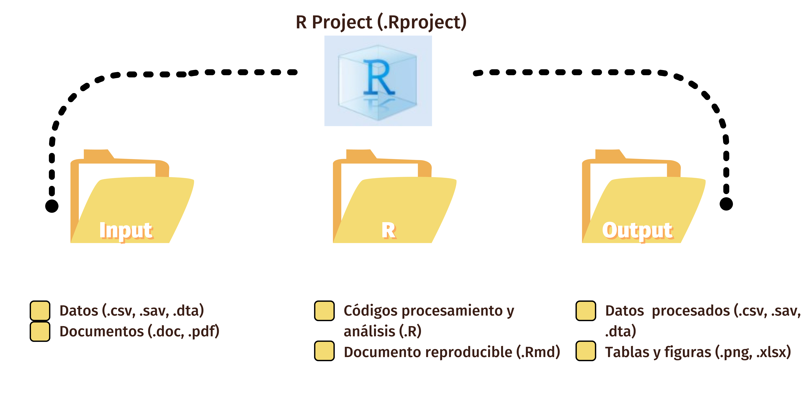
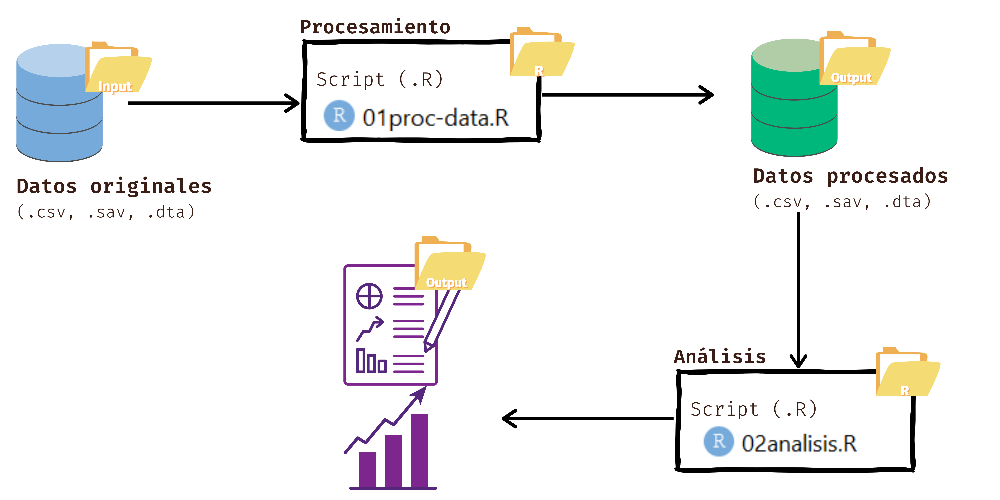
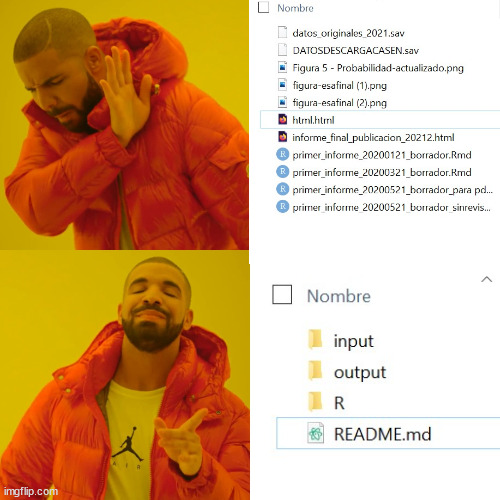
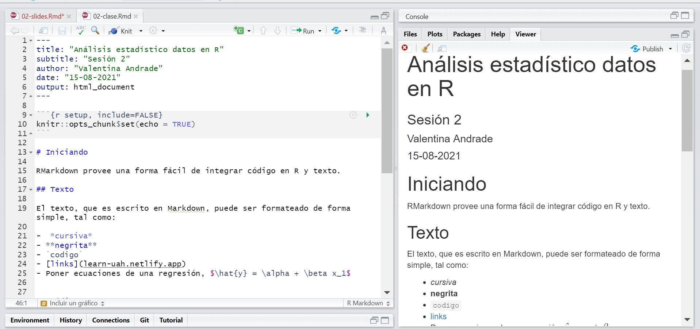
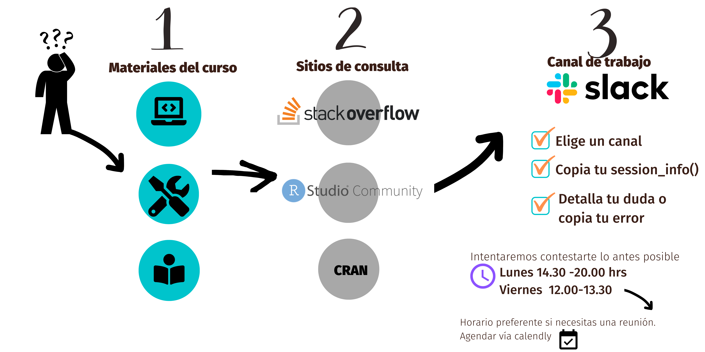

```{r setup, include=FALSE}
knitr::opts_chunk$set(warning = FALSE, message = FALSE, 
                      fig.retina = 3, fig.align = "center")
```

```{r packages-data, include=FALSE}
pacman::p_load(tidyverse, sjPlot, ggsci, wordcloud2)
theme_set(theme_sjplot2())
udp <- readRDS(url("https://github.com/learn-R/formR/raw/main/output/data-surveys.rds")) %>%   filter(university == "UDP" & rut !="")
datos <- dplyr::select(udp, id, rut, day, use_r, reason)
```

```{r xaringanExtra, echo=FALSE}
xaringanExtra::use_xaringan_extra(c("tile_view", "animate_css", "share_again", "scribble", "frezeeframe", "editable"))
```

```{r xaringanExtra-clipboard, echo=FALSE}
htmltools::tagList(
  xaringanExtra::use_clipboard(
    button_text = "<i class=\"fa fa-clipboard\">Copiar código</i>",
    success_text = "<i class=\"fa fa-check\" style=\"color: #90BE6D\">¡Listo!</i>",
    error_text = "<i class=\"fa fa-times-circle\" style=\"color: #F94144\"></i>"
  ),
  rmarkdown::html_dependency_font_awesome()
)
```

class: center middle main-title section-title-1 top-logo

.small[
# Herramientas para R -  II
]

.class-info[
<br>
**Sesión N° 2**<br>
**Análisis de datos estadísticos en R**
<br>

.pull-right.small[
**Profesora** Valentina Andrade de la Horra <br>
**Ayudantes** Dafne Jaime y Nicolás Godoy
.tiny[Universidad Alberto Hurtado<br>
]
]

]

---
class: title title-inv-1

# Contenidos Sesión N°2


.box-1.medium.sp-after-half[Repaso: **RStudio y Rprojects**]

--

.box-2.medium.sp-after-half[**Script en R** (.R)]
.box-2.small.sp-after-half[**Paso 1:Cargar paquetes**]

--

.box-3.medium.sp-after-half[**RMarkdown**]

???

- class details (rstudio)
- R enviroment (rscript)
- R pack  (rpack)
- R paquetemd (rmd)

---
class: center middle section-title section-title-1 animated fadeIn

# Vamos repasando ...

---
name: rstudio
class: center middle section-title section-title-1 animated fadeIn

.small[
.box-1-inv.large[# 1. RStudio]


.box-inv-3[el IDE (*integrated development enviroment*) para R]
]

---
layout: true
class: title title-1
---
# Básicamente 

.center[

]

---
# 1.1 RStudio

-  Integra lenguaje R con diferentes herramientas para facilitar su uso:

.pull-left.center[
.box-inv-2[(1) Consola]
<figure>
  
</figure>
]

.pull-left.center[
.box-inv-2[(2) Editor de sintaxis (código)]
<figure>
  
</figure>
]


---
class: title title-1

# 1.1 RStudio

.pull-left.small[
.box-inv-2[(3) Enviroment ]
<figure>
  
</figure>
]

.pull-right.small[
.box-inv-2[(4) Workspace]
<figure>
  
</figure>
]

---
class: title title-1

# 1.1 RStudio

.center[
.box-inv-2[(5) Plot, debugging (bugs o errores), historia]
<figure>
  
</figure>
]

---
layout: false
class: center middle section-title section-title-1 animated fadeIn

.small[
.box-1-inv.large[# Parte 1: Asimilando RStudio]

.box-inv-1[[Descargar el zip de la sesion 2 el sitio del curso](https://learn-r-udp.netlify.app/content/02-content/)]] 🌐

---
layout: true
class: title title-1

---
# 1.2 Rprojects

- Uno de los aspectos **más potentes** y **útiles** de RStudio es su capacidad de manejar proyectos. 

- La primera vez que tu abres R este está "posicionado" en alguna carpeta de tu computadora (*Working Directory*)

- No necesariamente esta carpeta contiene los datos que necesitas para tus análisis

- Por ello, **cada vez que inicias R tendrías que fijar tu directorio**.
---
class: center middle section-title section-title-1 animated fadeIn

# ¿Qué problemas se imaginan que esto podría traer?

---
# 1.2 RProjects

- Evita errores de definición de espacio de trabajo (*Working directory*)

```{r error1, message = TRUE, error=TRUE}

datos <- read.csv("datos.csv") #<<

```

--

- Un error muy **clásico** 😖

---
# 1.2 RProjects

- En caso contrario hay que ser unos detectives de rutas de los archivos🕵️‍♀️😂

```{r error, eval = F, echo = T}

datos <- read.csv("ruta_hacia_los_datos/datos.csv") #<<

datos <- read.csv("c: mi computador/carpeta datos/mi proyecto del curso/datos.csv")

```

---
# 1.2 Rprojects

- Permite crear un **directorio propio** 🌱 para un proyecto

- Este directorio propio podrá contener **todos** los recursos que utilizas para tu proyecto (sintaxis, datos, figuras)

.center[
]

---
# 1.2 Rprojects

- Sirve para esclarecer los **flujos de trabajos**

.center[
]

---
# 1.2 Rprojects

- Sirve para esclarecer los flujos de trabajos
.center[
]
---
layout: false

class: center middle section-title section-title-1 animated fadeIn

# Parte 2: ¡Repasemos cómo se hacen los .Rproject! 🧐

---
.small[
# Flujo propuesto para trabajar durante el curso
]
.center[
]

---
.center[
]
---
layout: false
class: center middle section-title section-title-1 animated fadeIn

# R + RStudio

--


---
name: rscript 
class: center middle section-title section-title-2 animated fadeIn

# 2. El script 👩🏽‍💻

---
layout: true
class: title title-2

---
# Script

- Piensen en una guía que una cocinera/o 👩🏽‍🍳

--

1. Los pasos deben ser realizados en **orden**: *no podemos  cocer verduras si no hemos hervido el agua*

--

2. Las **heramientas** tienen **funciones** definidas: *no podemos hervir agua con un tenedor* o con un *microondas*

--

*(o al menos si lo hacemos, nos demoraríamos mucho tiempo y gastaríamos mucha energía)*

---

# Script

- Lo mismo ocurre con la **programación**:

1. Hay un orden para llegar a los resultados 🔢

--

2. Hay herramientas que hacen posible la ejecución de sus procesos 🛠️

--

3. No podemos esperar un gráfico bonito si no sabemos cocinar👩🏽‍🍳, 

--

*perdón*, codificar  👩🏽‍💻 🙄

---

# Algunos shortcuts importantes 📌

Los siguientes atajos del teclado serán sus mejores amigos/as

- **Ejecutar** líneas de código del script:   <kbd>CTRL</kbd> <kbd>Enter</kbd>

- **Guardar** el script (archivo . R):   <kbd>CTRL</kbd> <kbd>S</kbd>

- **Nuevo** script (archivo . R):   <kbd>CTRL</kbd> <kbd>N</kbd>

- *Título automático* dentro del script: <kbd>CTRL</kbd> <kbd>Shift</kbd> <kbd>R</kbd>

---
# Encoding en el script

 > *¿Qué pasa si me aparece el script con símbolos raros?* En la barra del navegador de tu *RStudio* debes buscar:

.box-inv-2.center[
File → Reopen with Encoding → seleccionar `UTF-8`]

---

# Orden de un script
.center[

]

---
layout: false
class: center middle section-title section-title-2 animated fadeIn

# Parte 2: ¡Vamos a ver un Script!


---
layout: false
class: center middle section-title section-title-2

# Desde ahí se pueden crear cosas maravillosas

--

.box-inv-2[Pero, no siempre es suficiente para lograr nuestros propósitos 😢]

--

.box-inv-2[Muchas veces necesitaremos de **extensiones** para nuestros análisis]

---
layout: false
name: rpack
class: center middle section-title section-title-2 animated fadeIn

# Esas extensiones 🧩 las implementamos con **paquetes** 📦

---
name: rpack
class: center middle section-title section-title-2 animated fadeIn

# 3. 📦 Cargar paquetes en R

.box-inv-2[¡El primer paso del script!]

---
layout: true
class: title title-2

---
# ¿Qué es un paquete?

- Los paquetes 📦 o también llamado librearías 📚

--

- Siguiendo con la metáfora de la cocina, es como **implementar con herramientas para lograr hacer nuestro pastel**: hervidor, cubiertos, fuego, etc.

---
# ¿Qué es un paquete?

Pero cuidado con quemar la cocina, instalando **todo** o **cualquier cosa** 😖

```{r, eval = F}

install.packages("todos los paquetes de la vida") # Codigo de broma
```

.center[
]
---
# Pasos para cargar paquetes

- Este proceso de compone de dos partes esenciales

1.  Instalar paquetes (`install.packages()`)

2. Llamar paquetes (`library()`).

--

- El `sessionInfo()` es un paso que realizaremos para conocer el ambiente de desarrollo de nuestro RStudio


---
layout:false
background-image: url(https://c.tenor.com/7mxJp29REVkAAAAC/scaryfeet-monstersinc.gif)
class: bg-full center middle main-title section-title-2 top-logo

# Parte 3: ¡Volvamos a RStudio a **cargar paquetes**!

---
layout: true
class: title title-2

---
# Paso 1.  Instalar paquetes

- Utilizaremos `install.packages()`. Dentro del `()` tenemos que rellenar cuál paquete queremos instalar.

--

- Pero ... una pregunta lógica es ¿cómo sé eso? ¿qué argumentos o "cosas" se ponen dentro de una función?

---

# Consultas sobre paquetes 🤷‍♂️

Para ello hay dos enfoques que puedes seguir

1. Poner en tu consola `?nombre_de_la_funcion()` y notarás que en **Help** aparecerá automáticamente información de este. Esta información está contenida en [CRAN](https://cran.r-project.org/)

2. Buscar información del paquete en [https://www.rdocumentation.org/](https://www.rdocumentation.org/)


---

# Paso 1. Instalando paquetes `install.packages()`

```{r, eval = F}
install.packages("tidyverse") # Instalar
remove.packages("tidyverse") # Remover
```

También funciona la noción de una *cadena* de paquetes concatenados por `c()`

```{r, eval= F}
install.packages(c("tidyverse", "sjPlot", "sjmisc")) # Primera vez
```

---
# Paso 2. Llamar paquetes `library()`

- Con la función `library()`.

--

- Nos dirá algunas informaciones importantes (1) su versión, (2) los paquetes que trae si es una colección de estos (*attaching packages*) y (3) los **conflictos** con otros paquetes que ya tienes cargados.

```{r}
library(tidyverse)
```

---
# Una forma fácil de cargar paquetes: `pacman`

- `pacman` es un paquete que *literalmente* se comió procesos de R `base` y las simplificó en funciones únicas y más intuitivas. 

.center[

]
---
# `p_load()`

-  Resume las funciones `library()` e `install.packages()`
  - optimiza esta relación entre ambas pues solo las aplica cuando son necesarias (if `requiere()`), es decir, **¡no te reinicia R si ya está instalada la librería!**
  
--

```{r}
pacman::p_load(tidyverse,
               sjPlot,
               sjmisc)
```

- Las **dependencias entre paquetes** no será un tema del cuál preocuparte pues `pacman::p_load()` lo hace solito 👏🏼

---
# Paquetes del curso: `tidyverse` y `sj*`

- En la medida en que vayamos utilizando cada una de ellas, les iremos contando de las funciones que traen

--

- Pero, en general...

---
layout: false

.pull-left[
.box-2[(1) Preparación de datos]
.center[]
]

.pull-right.small[
.box-inv-2[(2) Análisis de datos]
.center[
]
]

--

- El paquete `sj*` lo entenderemos como un complemento al mundo tidyverse 
---
layout: false
class: center section-title section-title-3 animated fadeIn

.small[
# La manipulación y análisis las ocupamos con distintos propósitos 📚 📖
]
.can-edit.key-likes[
- ¿Qué cosas podrían ser? 🤔
¡Den sus ideas!
]

---
layout: false
name: rmd
class: center section-title section-title-3 animated fadeIn

# 3. **R** Markdown 📚 📖

---
layout: true
class: title title-3

---

# 3. RMarkdown

.box-inv-3[Una forma de integrar código R y sus resultados a nuestros reportes]

--

.center[
  - Informes 📑
  - Trabajos de la Universidad 📝
  - Tesis 📔
  - Presentaciones (slides) 👩‍🏫
  - Posters, blogs, otros 🌐

]
---
layout: false
class: center section-title section-title-3 animated fadeIn

.box-inv-4[**Comunicarse** <br> con quienes *toman decisiones*, que desean enfocarse en las conclusiones, no en el código que subyace al análisis.]

--

.box-inv-5[**Colaborar** <br> con otras personas que hacen análisis (¡incluyendo a tu yo futuro!), quienes están interesados tanto en tus conclusiones como en el modo en el que llegaste a ellas (es decir, el código).]

--

.box-inv-6[**Practicas** <br> como si fuera un **cuaderno moderno** donde puedes ir anotando + incorporando los procesos que haces]

---
layout: true
class: title title-3
---

# 3. Ventajas RMarkdown

- Los documentos en RMarkdown (.Rmd) son completamente reproducibles. 

--

- **Puede incorporar gráficos, tablas y otros resultados de R directamente en su documento.** 📉


--

- Es gratuito y de código abierto ✊🏼

--

- Se puede utilizar varios lenguajes, incluidos *R*, Python y SQL.

--

- Admite docenas de formatos de salida **estáticos y dinámicos**: .pdf, .docs, .ppt, presentaciones, libros, sitios web e incluso [aplicaciones](https://rmarkdown.rstudio.com/flexdashboard/index.html).

--

- Ejemplo: todo el sitio web de este curso está creado con RMarkdown (y [un paquete llamado **blogdown**](https://bookdown.org/yihui/blogdown/)). 🤯

---

layout: false
class: center section-title section-title-3 animated fadeIn

# **R** 👩🏽‍💻

--

# +

--

# Markdown ✏️


---
layout: true
class: title title-3

---

# Conceptos clave

[**RMarkdown**](https://rmarkdown.rstudio.com/) es un archivo (`.Rmd`) que puede integrar código de `R` (mediante *chunks*) y texto en [**Markdown**](https://learn-r-uah.netlify.app/resource/markdown/) a la vez.

--

> **RMarkdown** tienen una estructura de al menos 3 partes:

> 1. Encabezado (YAML)
> 2. Texto
> 3. Código de R

---
layout: false



---
layout: false


---
layout: true
class: title title-3
---

# 3.1 Encabezado (YAML)

- Configuraciones del archivo: [YAML](https://learn.getgrav.org/16/advanced/yaml).

- Incluye título, autor y formato de salida

--
- Si queremos que esté en PDF, colores, que incluya bibliografía, entre otros.

--

- La "cabeza" del Markdown o **YAMLS** está dividida del resto del cuerpo del texto al inicio y al final con tres líneas (`---`).

---
# Ejemplo

```yaml
---
title: Título de mi tesis
date: "16 de Agosto, 2021"
author: "Estudiante UAH"
output:
  html_document: default
---
```
---
# Opciones del YAML

- `title` y `subtitle`: es el título y subtítulo. Como cualquier carácter en R lo mejor es poner entre comillas su contenido

- `author`: nombre del autor/a

- `date`: fecha, puede ser escrita como ustedes quieran

- `output`: opciones de salida (html, pdf, doc, ¡incluso ppt!)

Si quieres ver más opciones, [temas para tu documento puedes ver aquí](https://bookdown.org/yihui/rmarkdown/html-document.html)

---

# 3.2 Markdown (.md)

- [Markdown](https://daringfireball.net/projects/markdown/) es una clase especial de lenguaje que permite darle **formato** a texto simple.

  - Por ejemplo, poder hacer cursivas, negritas, incorporar links, etc.

- Para que el formato que se le ha dado pueda ser visto, el archivo en Markdown (*.md*) pasa por un convertidor universal llamado [pandoc](https://pandoc.org/)

--

- Se abre en varios editores de texto: desde *block de notas* hasta RStudio.


???

Este, a diferencia de procesadores como los que ocupa Office no es pagado. Por ello, para no solo para editar tus archivos de texto no necesitarás un software, sino que para crear PDF, archivos .doc (Word), presentación (como las de Power Point) o HTML (para hacer sitios web) es **completamente gratis**. Solo debes encontrar un editor que pueda hacer esto.

---
.small[
# Formatos básicos de Markdown
]

.very-tiny[
<table>
<colgroup>
<col/>
<col/>
</colgroup>
<thead>
<tr class="header">
<th>Escribe…</th>
<th>…para obtener</th>
</tr>
</thead>
<tbody>
<tr class="odd">
<td><pre>Algo de texto en el párrafo.<br>
Más texto
espacio entre lineas.</pre></td>
<td><p>Algo de texto.</p>
<p>Algo de texto en el párrafo. Siempre utilizando
espacios para dividir párrafos</p></td>
</tr>
<tr class="even">
<td><code>*Cursivas*</code></td>
<td><em>Cursivas</em></td>
</tr>
<tr class="odd">
<td><code>**Negrita**</code></td>
<td><strong>Negrita</strong></td>
</tr>
<tr class="odd">
<td><code># Título 1</code></td>
<td><h2 class="smaller-h2">
Título 2
</h2></td>
</tr>
<tr class="odd">
<td><code>## Título 2</code></td>
<td><h3 class="smaller-h3">
Título 2
</h3></td>
</tr>
<tr class="even">
<td><code>[Link text](http://www.example.com)</code></td>
<td><a href="http://www.example.com">Link text</a></td>
</tr>
<tr class="odd">
<td><code></code></td>
<td></td>
</tr>
<tr class="odd">
<td><code>&gt; Citas</code></td>
<td><blockquote>
<p>Citas</p>
</blockquote></td>
</tr>
<tr class="odd">
<td><pre>1. Cosas en
2. listas
3. ordenadas</pre></td>
<td><pre>1) Cosas en
2) listas
3) ordenadas</pre></td>
<td><ol style="list-style-type: decimal">
<li>Cosas en</li>
<li>listas</li>
<li>ordenadas</li>
</ol></td>
</tr>
</tbody>
</table>
]

---
# 3.3 R Código en R (Chunks)

- Para ingresar **trozos** de código en R a nuestro documento ocuparemos los **chunks**.

- Estos permiten hacer análisis estadísticos dentro del documento visualizando los resultados en el documento final 

.center[]
---
# 3.3 Añadir un chunk

Hay tres formas de insertar chunks:

1. Pulsar `⌘⌥I` en macOS o  `Control + Alt + I` en Windows

2. Pulsa el botón "Insert" en la parte superior de la ventana del editor


---
# 3.3 Opciones de chunks

- El chunk será el código que permitirá ir haciendo **paso a paso** tus análisis 

--

- Pero...no siempre los vamos a querer mostrar en nuestros documentos finales.

- Algunas veces **solo queremos sus resultados** u otras veces solo queremos mostrar **partes específicas** del código de análisis. Eso dependerá del objetivo del documento

---
# 3.3 Opciones de chunks

- `echo=FALSE`: el chunk no se muestra en el documento final, pero los resultados si

- `include=FALSE`: el chunk y resultados no se muestran en el documento final, pero el código si se "corre"

- `eval = FALSE`: el chunk se muestra, pero no se ejecuta

- `message=FALSE`: omiten **mensajes** que genera R (como todas las notas que aparecen después de cargar un paquete)

- `warning=FALSE`: Se omiten las advertencias que genera R

- `fig.width=5` y `fig.height=3` (*o el número que quieras*): Establece las dimensiones de las figuras

---

# 3.3 Opciones de chunks: forma fácil ⚙️

- Hacer click al icono del engranaje en la esquina superior derecha del chunk (⚙️)


```{r chunk-options, echo=FALSE, out.width="70%"}
knitr::include_graphics("/img/reference/chunk-options.png", error = FALSE)
```

---
class: center section-title section-title-3 animated fadeIn

# ¡Vamos a nuestro .Rmd de ejemplo de la clase `02-clase.Rmd`


---
# Repitiendo los pasos

.box-6[ (1) Crear un archivo nuevo en .Rmd]

--

.box-7[ (2) Editar el .Rmd (YAML, texto y chunks)]

--

.box-8[ (3) Knit]

---

.center[

]

---
layout: false
class: center section-title section-title-1 animated fadeIn

# En síntesis

.box-1.medium.sp-after-half[Repaso: **RStudio y Rprojects**]

--

.box-2.medium.sp-after-half[**Script en R** (.R)]
.box-2.small.sp-after-half[**Paso 1:Cargar paquetes**]

--

.box-3.medium.sp-after-half[**RMarkdown**]

---
layout: false

.box-1[¿Y eso era?]

.center[
]

--

.box-inv-1[¡Solo por la sesión N°2!]

--
.box-1[En el práctico N°2 haremos nuestro primer RMarkdown y mostraremos instrucciones de la **Tarea N°1**]

---
.center[
]

---
layout: false
class: center middle main-title section-title-1 top-logo

.small[
# Herramientas para uso de R - II
]

.class-info[
<br>
**Sesión N° 2**<br>
**Análisis de datos estadísticos en R**
<br>

.pull-right.small[
**Profesora** Valentina Andrade de la Horra <br>
**Ayudantes** Dafne Jaime y Nicolás Godoy
.tiny[Universidad Alberto Hurtado<br>
]
]

]
